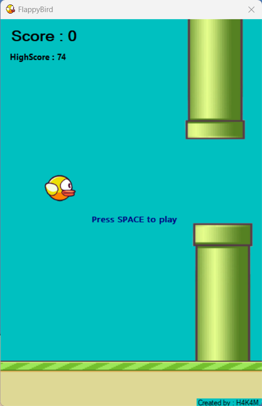
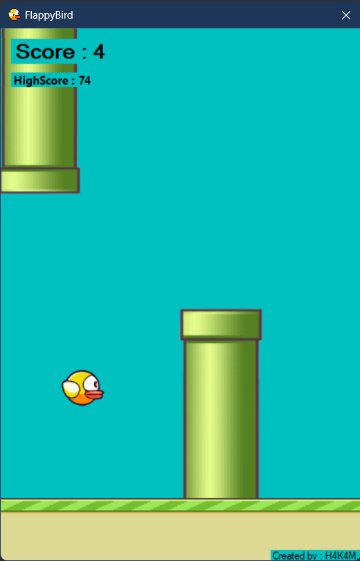

# FlappyBird
## About Project
Basic Flappy bird game inspired by a Moo ICT youtube channel to practice writing C# language and Windows form

Moo ICT >> [C# Tutorial - Make a flappy bird game in windows form](https://www.youtube.com/watch?v=yUCCv-sFUDQ&ab_channel=MooICT)

## Prerequisites
You can install the application using the [setup.exe](https://github.com/H4K4M/FlappyBird/tree/main/FlappybirdSetup). The new version update will be anounced to [H4K4M
/FlappyBird](https://github.com/H4K4M/FlappyBird) or tou can check in [my gitHub profile](https://github.com/H4K4M) 

## Technologies utilised

  
  

## UI Screenshots

### First Page

First page after opening the game

### Game Play

### Game Over

